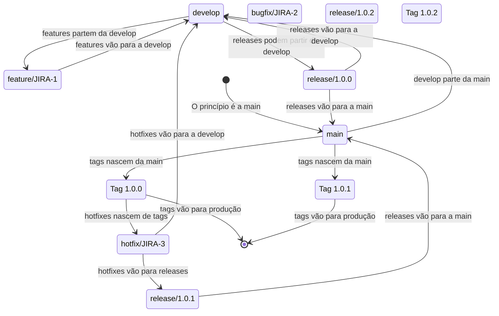
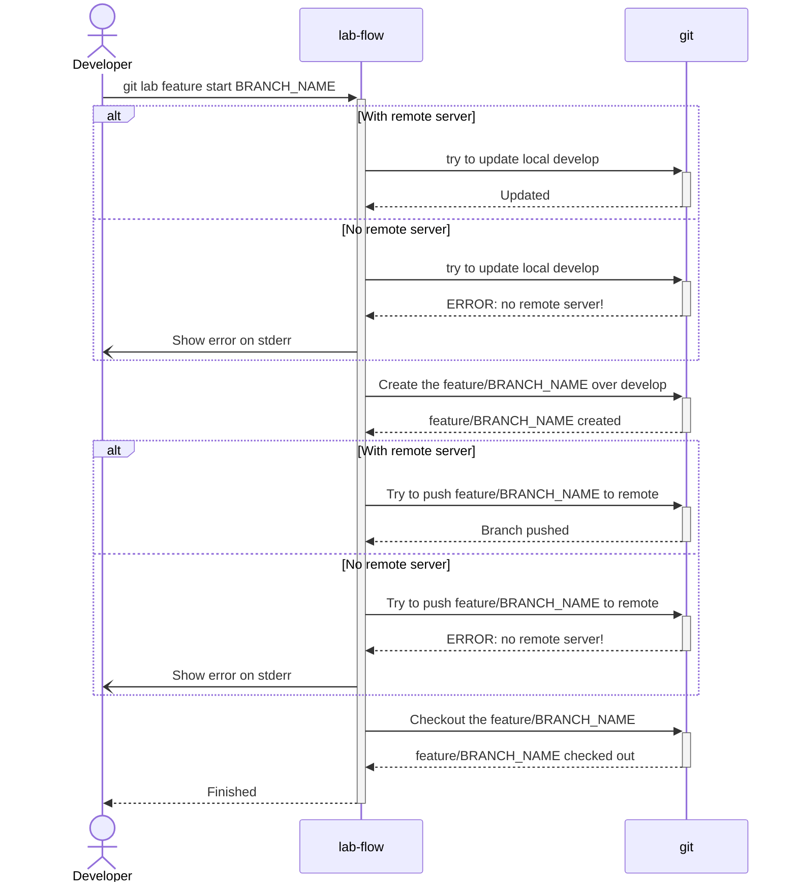
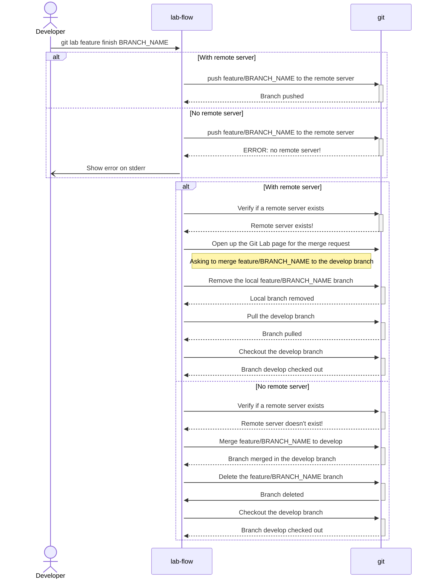

# lab-flow

TODO: Explain the project

- [lab-flow](#lab-flow)
  - [1. Feature](#1-feature)
    - [1.1. `git lab feature start [BRANCH_NAME]`](#11-git-lab-feature-start-branch_name)
    - [1.2. `git lab feature finish [BRANCH_NAME]`](#12-git-lab-feature-finish-branch_name)
  - [2. Bugfix](#2-bugfix)
    - [2.1. `git lab bugfix start [BRANCH_NAME]`](#21-git-lab-bugfix-start-branch_name)
    - [2.2. `git lab bugfix start [BRANCH_NAME] --release [RELEASE VERSION]`](#22-git-lab-bugfix-start-branch_name---release-release-version)
    - [2.3. `git lab bugfix finish [BRANCH_NAME]`](#23-git-lab-bugfix-finish-branch_name)

## 1. Feature

TODO: Explain what a feature is

### 1.1. `git lab feature start [BRANCH_NAME]`

TODO: Explain the git lab feature start command

### 1.2. `git lab feature finish [BRANCH_NAME]`

TODO: Explain the git lab feature finish command and that commits must have been done previously.

## 2. Bugfix

### 2.1. `git lab bugfix start [BRANCH_NAME]`

If a bugfix was found in the `develop` branch.

It is the same design of a feature branch but it uses the `bugfix/` prefix informed with `git lab init`.

### 2.2. `git lab bugfix start [BRANCH_NAME] --release [RELEASE VERSION]`

Some error found in the latest release. We need to update the informed release version. If the branch `release/[RELEASE_VERSION` don't exist, we give an error. If it does exist, we use it as the source of the new `bugfix/BRANCH_NAME`.

### 2.3. `git lab bugfix finish [BRANCH_NAME]`

If the branch started from a 
